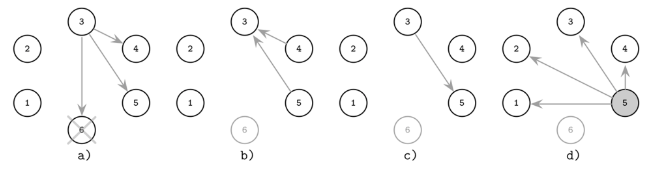
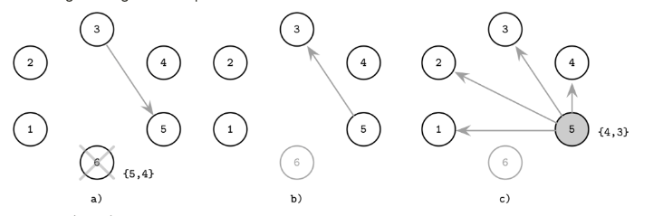
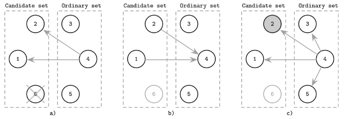
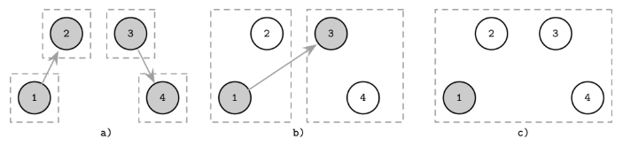
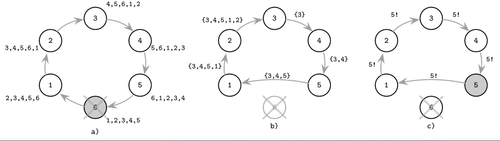

# Chapter 10. Leader Election 
- Cluster에 leader를 활용했을 때 장단점  
  - 동기화에 필요한 message 송수신 횟수를 줄일 수 있음 
    - peer-to-peer coordination 수가 적어짐 
  - leader이 병목의 중심이 될 수 있음 
    - Spanner의 경우 replica set별로 leader가 존재 
  - leader 프로세스도 언젠가는 다운됨 => failure detection이 필요 

## Bully Algorithm
- Highest rank 노드가 다른 노드를 관리(bully)
- 노드에서 실행되는 프로세스별로 unique rank가 부여됨 
  - 클러스터에 leader가 없다고 판단되는 경우 leader election을 시작 
    - 
- 단점 
  - Network partition 상황에서 split brain 현상이 발생할 수 있음.
  - Higher ranked 프로세스의 상태가 좋지 않은 경우 전체 클러스터의 성능이 저하됨.

## Next-in-line Failover 
- 선출된 leader는 failover 시 사용할 수 있는 node list를 제공 
- leader가 다운된 경우 failover list에서 높은 rank 순으로 leader를 선출하도록 시도 

1. 6 fail -> 3 contacts 5(failover list에 포함됨)
2. 5는 3에게 alive response를 제공 
3. 5 leader 

## Candidate/Ordinary Optimization 
- leader election에 필요한 송수신 메시지의 수를 줄이기 위한 최적화 방법 
- candidate / ordinary 그룹으로 구분해서, candidate 그룹에 속한 프로세스만 leader가 될 수 있도록 설정 

1. 4 프로세스는 leader 실패를 감지 -> candidate에 문의  
2. candidate(1, 2) alive 응답 
3. 4 프로세스는 candidate 2를 leader로 인식 

## Invitation Algorithm 

- group이 존재하고 group의 leader은 다른 프로세스를 초대함 
- group끼리 병합될 때 하나의 leader가 선출 

## Ring Algorithm

- 노드를 ring 형태로 배치. 노드는 이전 노드와 이후 노드에 대해 인지하고 잇음 
  - election message는 ring 형태로 전달 
- message가 한바퀴 돌면 highest rank node를 식별할 수 있음 
- network partition 발생 시 split brain 발생 가능 
