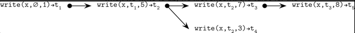

# Chapter 11. Achieving Availability 
- CAP theorem 
  - Availability
    - 성공적으로 request를 처리하는것을 가정. 단, timeout 제한이 부재
  - Consistency 
    - atomic + inconsistent 상태를 유도하지 않음 
  - Consistent + Partition tolerant 
    - 상태 일관성을 위해 요청에 대한 응답이 실패하는것을 선호 
    - e.g. consensus system 
  - Available + Partition tolerant 
    - 가용성을 위해서 상태 일관성을 어느정도 포기할 수 있음 
  - Partition tolerance 
    - CAP 이론에서는 마치 partition tolerance를 하나의 선택지처럼 보이게 함 
      - PACELC 
    - Partition tolerance는 다른 특성을 위해 포기할 수 있는 특성이 아님 

## Harvest and Yield 
- CAP 
  - linearizability 상황을 가정 
    - too restrictive -> Harvest and yield라는 조절 가능한 메트릭을 활용하는건 어떨까 ? 
- Harvest and yield
  - CAP는 trade-off 느낌이라면, Harvest and Yield의 경우 상대적인 척도 
  - harvest 
    - 요청을 얼마나 완벽히 처리했는지 
    - e.g. 100개의 데이터를 반환해야하지만 99개만 반환한 경우? 완전한 실패로 보지 않는다 
  - yield 
    - (요청에 대한 성공한 응답) / (전체 요청)

## Consistent Models 
- 동시에 실행되는 write 또는 read의 결과를 예측하려면 어떤 consistency model에 대해 이야기하는지 정하는게 우선 
- Consistency model 
  - 참가자간의 계약

### Strict consistency 
- 쓰기 작업이 발생하는 순간 이후 수행되는 모든 읽기에 해당 쓰기 결과가 보임 
- 실제 환경에서 구현 불가능(물리법칙의 한계)

### Linearizability 
- 구현가능한 모델 중 가장 엄격한 consistency model 
- 시스템의 모든 프로세스는 동일한 데이터를 확인할 수 있음 
- 쓰기 작업의 결과가 특정 시점(linearization point) 이후 모든 읽기 작업에서 확인할 수 있음
  - 읽기 작업은 state transition, side effect를 확인할 수 없음
  - linearization point 시점 이후에 쓰기 작업의 결과를 확인할 수 있음 
- 특정 읽기 결과가 version 1이라면, 이후의 읽기 결과는 모두 version 1과 같거나 최신의 값이어야함
- 비용 
  - 비쌈 
  - concurrent programming에서는 CAS로 구현 
  - distributed system 
    - consensus를 활용 
    - 쓰기 작업은 linearization point 이후 확인 가능한 상태가 됨 
### Sequential consistency 
- 동일 프로세스에서 수행된 작업은 순서가 유지, 서로 다른 프로세스인 경우 순서가 유지되지 않음 
  - global order은 프로세스마다 다르게 보일 수 있음 
- Linearizability와 공통점/차이점 
  - 공통점 
    - 작업이 전역적으로 정렬되는 특성을 지님 
  - 차이점 
    - linearizability는 local, global order이 일관됨을 요구하나 sequential consistency의 경우 local order에 대한 일관성을 요구 
    - linearizable한 작업을 조합하면 linearizable한 결과가 나옴. Sequential consistent한 작업을 조합하면 그렇지 않음 
- CPU 
  - modern CPU의 경우 sequential consistency를 유지하지 않음 
    - instruction reordering 
  - memory barrier 등을 활용해서 어느정도 조절할 수 있음 
- Java volatile and memory barrier 
  - volatile 
    - can't be reordered 
    - ensure data visibility to other threads 
    - memory barrier을 활용(`lock_add`라는 명령어가 추가됨)
      - memory barrier을 활용함으로써 instruction reordering을 제한할 수 있음 
  - visibility 
    - flush to memory ? NO -> CPU의 cache coherent protocol 
    - volatile이 적용되는 부분은 register <--> L1 cache간의 Load/Store buffer 
  - reordering 
    - 왜 발생할까 ? 
    - CPU에서 memory load룰 수행한다면 ? 
      - CPU의 연산속도와 memory load 속도가 차이가 너무 큼. 독립적인 memory load 작업이라면 병렬로 실행할 수 있지 않을까?(with instruction reordering)
  - CPU store buffer
    - 메모리에 적용되기 전에 잠시 Store instruction을 보관하는 장소 
    - store instruction이 처리되는 동안에도 이후의 instruction이 수행될 수 있도록 함
  
### Causal Consistency 
- 모든 프로세스에서 인과 관계에 있는 작업들의 순서가 동일하게 보임 
  - 인과 관계가 없는 경우 순서가 달라보여도 상관 없음 
- Vector clock 
  - causual order을 확인하기 위한 수단 
  - Dynamo, Riak
  - 
  - conflict 발생했음을 알 수 있지만 어떻게 해결하는지 모름 
    - Cassandra의 경우 vector clock 대신 LWW(Last-Write Wins) 정책을 활용 

### Session Models
- client-centric consistency model 
  - client 입장에서 시스템의 일관성을 생각하는 모델 
- read-own-writes consistency model 
  - write 이후 read 결과는 쓴 값 
- monotonic read model 
  - V1 데이터를 읽었다면, 그 이후의 읽기는 최소한 V1 또는 그보다 최신 데이터를 읽어야 함 
- monotonic write model 
  - write(x, V1) -> write(,x, V2): 쓰기 작업의 결과가 보이는 순서는 쓰기 순서와 동일 
- writes-follow-read model 
  - write(x, V1) -> read(x) / read(x) -> write(x, V2) => write(x, V1) -> write(x, V2)

### Eventual Consistency 
- eventually -> time limit X 
- 쓰기작업이 비동기적으로 전파됨 

### Tunable Consistency 
- Variables 
  - replication factor: `N`
    - 복제 수 
  - write consistency: `W`
    - write가 성공하기 위해서 최소 W개의 노드에서 응답해야함 
  - read consistency: `R`
    - read가 성공하기 위해서 최소 R개의 노드에서 응답함 
- `R + W > N` 
  - 가장 최신 value를 언제나 확인할 수 있는 설정 
- quorum(majority)
  
### Witness Replicas 
- replication + majorities를 활용하는 경우 저장 비용이 너무 큼 
- replica 노드의 타입을 copy / witness 으로 구분 
  - copy 
    - 데이터의 사본 저장(기존 복제와 동일) 
  - witness 
    - 쓰기 작업이 수행됐음을 나타내는 데이터를 저장함 
    - 임시로 copy 노드로 업그레이드될 수 있음 

### Strong Eventual Consistency and CRDTs
- Strong eventual consistency 
  - 순서와 상관없이 쓰기작업이 전파될 수 있음 
  - 최종적으로 conflict가 해결되고 유효한 값이 반영됨  
- CRDT(Conflict-Free Replicated Data Types)
  - e.g. Redis 
  - conflict가 없을거라고 가정함 
    - e.g. distributed counters -> 나중에 merge 하면 됨 
  - 복제가 수행되는 순서가 상관없으면 사용했을 때 효율이 좋음
