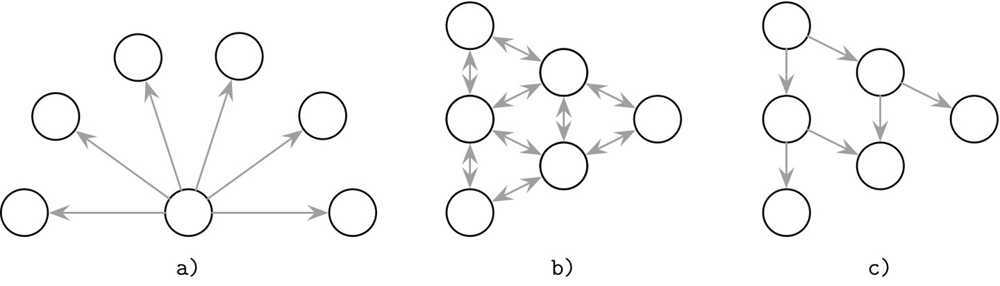
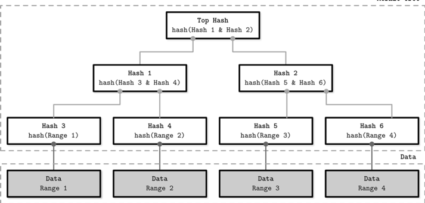
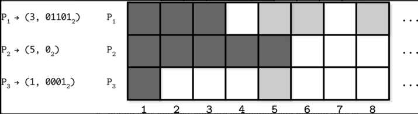
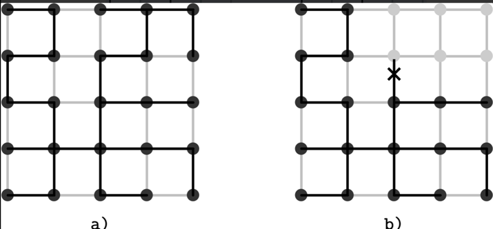
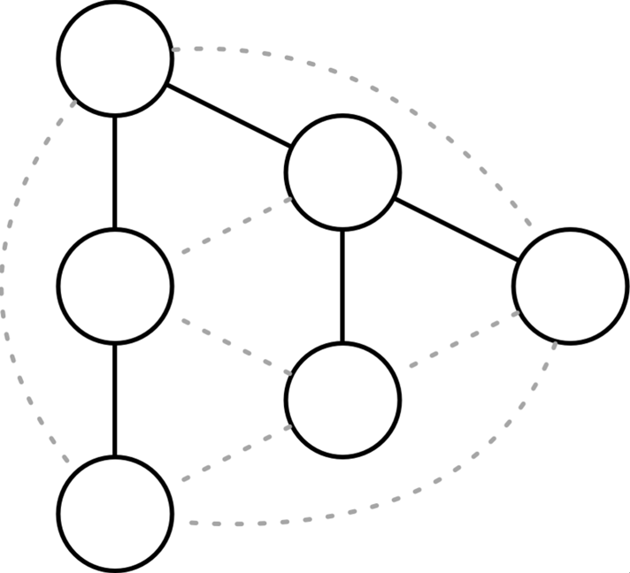

# Chapter 12. Anti-Entropy and Dissemination 
## Communication patterns

- a) Broadcasting 
- b) Peer-to-Peer information exchange 
- c) Cooperative broadcast
## Anti-entropy 
- 분산시스템에서의 엔트로피란 노드간 상태가 얼마나 일치하지 않는지의 정도
- 엔트로피를 낮추는게 anti-entropy 

### Read Repair 
- 읽기 시점에 state divergence를 해소 
  - 여러 노드로부터 읽기 -> 결과가 다른 경우 coordination

### Digest Reads 
- digest request 
  - 요청에 대한 결과를 그대로 리턴하는게 아닌 hash(결과)를 리턴 
  - 모든 노드로부터의 digest request 결과가 동일하면 모든 노드가 동기화된 것 

### Hinted Handoff 
- write-side repair mechanism 
- 복제를 위해 쓰기 전파 중 target 노드가 다운된 경우 
  - target 노드 이외의 노드에 hint를 저장 
  - hint는 target 노드가 복구되면 재실행됨
### Cassandra hinted handoff 

1. t0: client는 coordinator로 쓰기 요청(replica_2는 재실행중이라서 복제 요청을 처리 불가)
2. t1: coordinator는 client에게 quorum으로부터 취합한 결과를 전달 
3. t2: timeout 이후 replica_2가 요청을 처리할 수 없는 상태임을 인지. local disk에 hint를 저장 
4. t3: replica_2가 재실행된 이후 gossip message를 전파(coordinator, other replicas)
5. t4: coordinator이 replica에게 hint를 replay
### Riak sloppy quorums 
- 복제를 수행해야하는 노드가 다운됐을 때, 정상적으로 실행중인 노드에 hint를 저장 
  - 다운된 노드가 복구되면, hint를 전달함으로써 복구를 실행

### Merkle Trees 

- 일관성이 깨진 부분이 어딘지 쉽게 파악 
  - hash를 통해 일관성 여부를 판단 
- subtree를 비교함으로써 inconsistent 영역을 특정 

### Bitmap Version Vectors

- `recency`를 활용해 데이터 충돌을 해결 
  - 각 노드는 peer당 작업을 기록하는 로그를 저장
  - anti-entropy 과정에서 누락된 데이터를 대상 노드로 전달 

## Gossip Dissemination 
- Gossip protocol 
  - 사람들이 소문내는 원리와 유사 
- Configuration parameter 
  - fanout(f) 
    - 랜덤으로 f개의 peer 노드를 선택해서 gossip message를 전달 
  - latency 
    - fanout에 의해 결정 
    - large fanout: stable latency, more message delivery 
    - small fanout: higher latency, less message delivery 

### Overlay Networks 
- Gossip protocol의 특징 
  - 랜덤 peer 노드로 메시지를 전달 
    - 시스템의 안정성을 높일 수는 있지만 .... 최적화된 메시지 전달 방식은 아님(중복 등)

- Overlay network 
  - gossip 시스템에서 일시적으로 고정된 topology를 활용 
  - 중복 메시지의 양을 줄이면서도 시스템의 신뢰성을 높일 수 있음 

### Plumtrees(Push/lazy-push multicast trees)

- 최적화된 노드 연결 방식을 활용 
  - spanning tree(최소 연결 그래)
- double connectivity 
  - 실선: spanning tree line 
  - 점선: lazy gossip network 
    - 주변의 노드에게 어떤 메시지를 받았는지 알려줄 때 사용
    - 트리를 재구성하거나 고칠 때 사용 