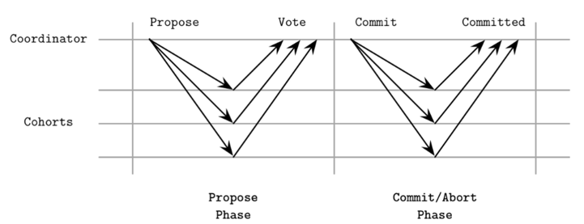
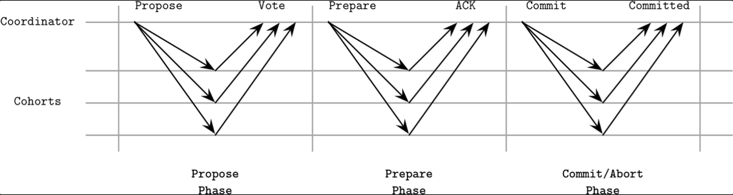
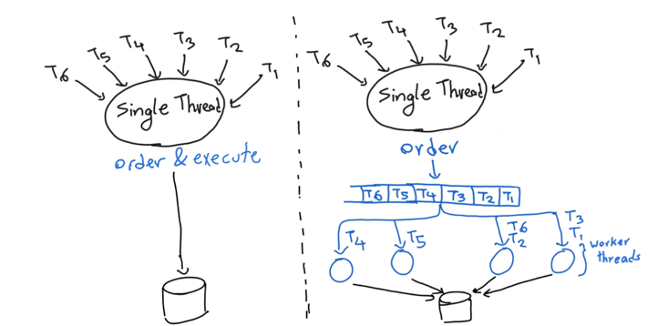
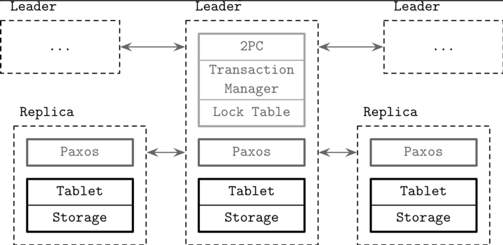

# Chapter 13. Distributed Transactions 
## Atomic commitment 
- 다수의 작업을 하나의 atomic 작업처럼 보이게하기 위해서는 atomic commitment을 활용 
- Atomic commmitment 
  - 참여중인 노드 중 하나라도 반대하는 경우 commit이 불가능함 
  - Byzantine failure 시나리오에서는 동작하지 않음(노드가 거짓말을 할 수 있기 때문) 
  - transaction manager을 활용 
    - 분산 트랜잭션 처리를 위한 컴포넌트 
    - 트랜잭션을 위한 스케쥴링, 조율, 실행 등 
  - 2PC, 3PC 
    - 2PC: 분산 트랜잭션 가능, 하지만 coordinator 실패시 사용 불가 
    - 3PC: 분산 트랜잭션 가능, coordinator 실패 시에도 사용 가능 
### 2PC(Two Phase Commit)
- 구성 
  - leader 
    - 상태 데이터 저장 및 투표를 진행하는 노드 
  - cohort 
    - leader이외의 노드 
    - leader에 의해 제안된 값을 승낙 또는 거절(voting)

- 동작방식
  1. Propose phase  
     - 합의하고자하는 값을 투표하도록 `Propose` 메시지를 cohort들에게 전달 
     - cohort는 승낙 또는 거절 메시지를 전달(local에 투표 결과를 저장)
     - leader은 투표 응답을 로컬에 저장 
  2. Commit/Abort phase 
     - 모든 cohort가 찬성하는 경우 commit을 진행 
- 로컬에 투표 결과를 저장하는 이유 
  - 2PC 과정에서 실패가 발생하는 경우 복구를 위함 
- 단일 트랜잭션을 위해서 주로 사용됨 
  - Propose 단계에서 cohort는 이미 transaction을 실행한 상태 
  - Coordinator에서 최종 확인을 하는 형태 
- Coordinator fail이 발생하는 경우, 대체 노드에서는 해당 트랜잭션에 대한 정보를 수집해서 트랜잭션을 완료해야함 
  - 2PC를 사용하는 경우 back-up coordinator이 필요함 

### 3PC(Three Phase Commit)

- 2PC와 다르게 coordinator fail시에도 동작 
- 중간에 `Prepare` 단계가 추가되는 형태 
- 동작 방식 
  1. Propose phase 
     - 값을 제안하고 투표 응답을 받는 단계 
  2. Prepare phase 
     - 투표 결과를 cohorts에게 알리는 단계 
     - 투표 결과에 반대가 없다면 `Prepare` 메시지를 전달. 그렇지 않으면 `Abort` 메시지를 전달 
  3. Commit/Abort phase 
     - 트랜잭션 커밋을 수행하도록 메시지를 전달 
- 실패 시나리오 
  - Propose phase에서 실패 
    - cohort는 그 누구도 commit하지 않았기 때문에 문제되지 않음. 대응 X 
  - Prepare phase에서 실패
    - cohorts `Prepare` 메시지 수신 전 coordinator 실패: 문제 X 
    - cohorts `Prepare` 메시지 수신 후 coordinator 실패: cohorts는 timeout이후 해당 트랜잭션을 신경쓰지 않으면 됨 
  - Commit/Abort phase 
    - 그 어디에서 실패하든 commit을 수행하면 됨 
- 자주 사용되지 않음 
  - 너무 많은 메시지 부담 
  - network partition에서는 정상적으로 동작하지 않음 

## Calvin 

- "결정가능한 트랜잭션 순서"
  - replica는 동일한 input을 받고 동일한 output을 생성 
- 각 replica에서 실행되는 트랜잭션은 global view에서 동일한 순서이어야함 
- Sequencing layer 
  - 확장성과 가용성을 고려해 트랜잭션간 순서를 global view에서 보장 

## Spanner 

- 동작방식 
  - `TrueTime`을 사용해 트랜잭션 순서를 결정 
    - 시간과 관련된 API 
    - 오차 범위를 함께 제공 
  - Cross-shard 트랜잭션을 위해서 2PC를 사용 
  - 트랜잭션 로그 복제를 위해 Paxos를 활용
