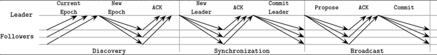
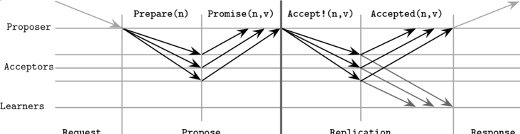
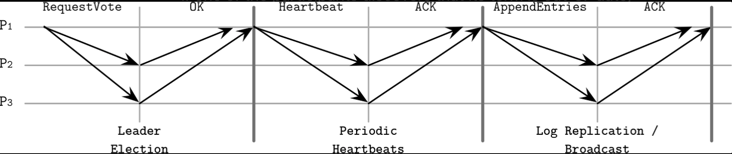
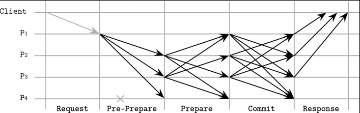

# Chapter 14. Consensus 
- 현재까지 학습 내용 
  - links, processes 
  - Distributed computing 
  - Failure model 
  - Failure detector 
  - Leader election 
  - Consistency model 
  - Distributed consensus 

## Broadcast 
- `broadcast`란 
  - 분산환경에서 노드간 통신 방식
    - e.g. gossip 
- `best effort broadcast`
  - 메시지의 송신자가 메시지를 전달할 책임이 있음 
  - 송신자가 다운된 경우, 다른 노드가 메시지를 전달하지 않기 때문에 메시지 전송은 실패함 
    => 낮은 신뢰성
  - 신뢰성을 높이기 위해서 다음과 같은 시스템 기능이 필요  
    - failure detector 
    - fallback mechanism
    => 신뢰성을 보장하는 방식을 `reliable broadcast`
## Atomic Broadcast 
- 여러 메시지를 보낼 때, 메시지간 순서를 보장해야하는 경우 broadcast를 사용할 수 없음 
- `Atomic broadcast`
  - 다음과 같은 특성을 보장 
    - atomicity
      - 분산된 프로세스들은 하나의 메시지에 투표 
      - 다운되지 않은 모든 프로세스에서 메시지를 전송. 만약 그렇지 않다면 모든 프로세스에서 메시지를 전송하지 않음 
    - order 
      - 다운되지 않은 모든 프로세스에서 동일한 순서의 메시지를 전송 
## ZAB(Zookeeper Atomic Broadcast)
- 프로덕션 환경에서 사용되는 Atomic broadcast의 구현체
- ZAB 
  - hierarchical distributed key-value store 
  - 복제 데이터의 일관성을 유지할 수 있도록 atomic broadcast를 활용 
- 구성 
  - leader 
    - 일시적인 역할 
    - followers에 메시지를 전달하고 이벤트 순서를 결정함 
  - follower

- 동작 방식
  1. Discovery 
     - leader로 선출되고자하는 노드는 다른 노드로부터 가장 최신 epoch 값을 확인 
     - 확인된 epoch보다 높은 epoch값을 제안(epoch proposal)
       - follower이 제안된 epoch 보다 더 최신의 epoch 값을 가지고 있다면 leader의 epoch proposal을 거절 
     - follower은 제안된 epoch 보다 이전의 epoch에서 확인한 최신 transaction을 응답
  2. Synchronization 
     - 이전 leader가 실패한 지점으로부터 복구 진행 및 follower에 전파되지 못한 복제를 진행 
     - leader으로 승격 
  3. Broadcast 
     - 메시지의 복제가 시작 
  - 이전 메시지에 대해 복제본들이 모두 응답하지 않으면 새로운 메시지를 전달하지 않음 
    =>ZAB이 메시지의 순서를 보장하는 방법

## PAXOS 
- 구성 
  - proposer
    - 클라이언트로부터 요청을 받아서 처리 
    - acceptor에게 consensus를 위한 값을 제안(proposal)하여 투표를 진행 
  - acceptor 
    - proposer에게 전달받은 값을 승낙/거절 
  - learner 
    - 투표 결과값을 저장하는 복제 노드 
- Proposal 
  - (클라이언트가 제공한 값, monotonically increasing proposal number) 형태로 구성 
    - proposal number: 메시지의 글로벌 순서를 보장하기 위해 사용되는 값 
      - (node id, timestamp) 형태로 구성

- 동작 방식 
  1. Propose 
     - proposer은 클라이언트로부터 전달받은 값을 투표에 부침 
       - majority로부터 응답을 받은 경우 다음 단계로 이동 
     - acceptor에서 투표를 거부하는 경우 
       - 이전에 더 높은 proposal number을 확인한 경우 => 더 높은 proposal number의 존재에 대해 proposal에게 알림
  2. Replication 
     - acceptor에게 값을 전달하는 단계 
     - acceptor은 아래 조건에서 accept를 거절할 수 있음 
       - `m > n`이라고 가정했을 때, 해당 노드가 이미 `Prepare(m)`메시지에 응답했고, 현재 proposal으로부터 전달된 메시지가 Accept(n, v)일때 거절가능 
  - Paxos는 모든 단계마다 1, 2를 반복해야함 => 이를 간소화한게 multi paxos 

## Multi-Paxos 
- Paxos의 단점을 극복하기 위해 등장 
  - leader(distinguished proposer)의 도입 
  - 메시지를 전파할 leader의 존재를 알기 때문에 propose 단계를 스킵할 수 있음 
- lease
  - leader 역할을 가진 노드는 lease를 소유해야함 
  - lease를 소유할 수 있는 시간은 다른 참가 노드에 요청하여 lease 기간을 연장할 수 있음 
- 참가 노드간 clock 시간의 차이가 크다면 문제가 발생할 수 있음 
  - 노드간 lease의 만료여부 판단이 달라질 수 있음

## Raft  
- Paxos는 너무 복잡하지 않는가 ... 
- Raft의 특징 
  - 커맨드 수행의 결과를 로그 형태로 보관 
    - 서로 다른 노드에서 동일한 로그를 전달받기 때문에 각 노드에 반영된 결과도 동일 
    - 동일한 로그를 전달하기 위해 하나의 leader을 사용 
  - 구성 
    - leader 
      - 일시적인 역할 
      - 클라이언트의 모든 요청을 처리하고 다른 노드로 복제 로그 송신 
    - candidate
      - 모든 노드는 leader가 될 수 있음
      - follower -> candidate -> leader 
    - follower 
      - 모든 노드는 가장 처음에 follower으로 시작 
      - 복제를 위한 로그를 저장 
  - term 
    - 특정 노드가 leader일 수 있는 기간 
    - 단조증가하는 값으로 표현

- Leader election 
  - candidate는 다른 노드에 `RequestVote` 메시지를 전달함 
    - `RequestVote` 메시지는 candiate의 `term`과 가장 마지막으로 확인한 로그 ID를 포함
    - `RequestVote` 메시지를 수신한 노드 중, 메시지의 로그 ID보다 최근의 로그를 저장하고 있는 follower이 존재하면 해당 follower은 투표 거부 
  - majority로부터 찬성 메시지를 받으면 leader로 승격 
- Periodic Heartbeats 
  - leader -> follower 
  - follower이 특정 시간 내 heartbeat를 받지 않으면 leader election을 시작 
- Log replication / Broadcast 
  - `AppendEntries` 메시지 송신 
    - 추가할 로그와 관련된 메시지 
  - `AppendEntries` 메시지를 수신한 follower는 로컬 디스크에 로그를 추가하고 완료됐음을 leader에 알림 
    - leader이 충분한 수의 follower으로부터 응답을 받으면 leader도 로컬 디스크에 저장 
- 발생가능한 문제 
  - split vote 
    - 여러 follower에서 동시에 leader election을 시작  
    - Raft는 이를 해결하기 위해서 follower가 leader election을 시작하는 시간을 랜덤하게 설정 
  - 메시지 중복 
    - 중복된 메시지를 송신하는 경우 follower은 자동으로 deduplication 수행 
    - message ID가 존재하기 때문 
- Raft를 사용하는 소프트웨어 
  - CockroachDB, Etcd, Consul 

## Byzantine Consensus 

- 참가 노드 중 의도적으로 잘못된 정보를 전달할 수 있는 상황에서 consensus가 필요한 경우 사용 
- PBFT(Practical Byzantine Fault Tolerance)
  - 전체 시스템이 동시에 비정상적으로 동작하는 상황은 고려하지 않음 
  - 비정상적으로 동작하는 노드의 수를 `f`개 허용한다면 PBFT 구성을 위해 `3f + 1`개의 노드가 필요함 
- Byzantine consensus는 그 알고리즘의 비용이 크기 때문에 용도에 맞게 사용해야함 

