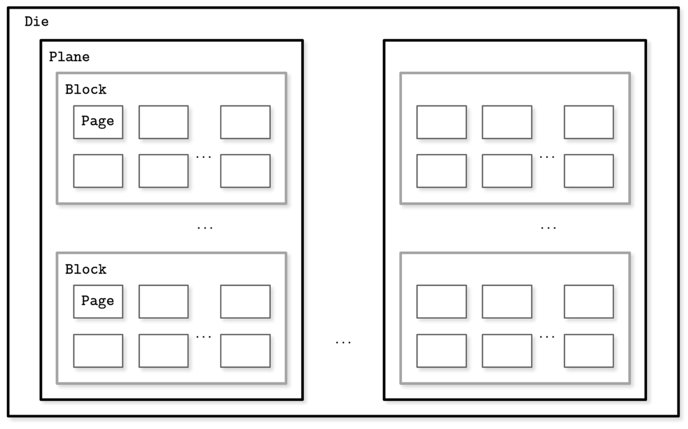

# Chapter 2 
## B-Tree 
- Binary tree(X) -> Balanced tree(? 불분명한 어원)
- Disk based 자료구조로 일반 binary tree를 사용한다면 
  - low fanout, tree height가 높기 때문에 disk 탐색 비용이 큼 
  - rebalancing이 자주 발생
  - 관련성이 높을 수 있는 인접한 노드가 디스크 상에서 멀리 위치할 수 있음 -> 지역성이 떨어짐

## Disk  
- HDD 
  - random read 취약 
  - sector 단위로 읽기/쓰기 
- SSD 
  - 
  - memory cell -> string -> array -> page -> block -> plane -> die 
    - cell: 한개 또는 다수의 bit 
    - page: 
      - 2 ~ 16kb 
      - SSD의 최소 쓰기 단위
      - empty memory cell에만 쓰기작업이 필요 -> memory cell이 차있으면 삭제 작업 필요 
    - block: 
      - 64 ~ 512 page 
      - 최소 삭제 단위
    - HDD에 비해 random read 성능이 덜 나쁘긴 하지만... 여전히 random read는 SSD의 성능에도 악영향 
      - prefetching 
      - reading contiguous page 
      - internal parallelism 
- OS에서 disk의 읽고 쓰는 작업을 추상화 
  - block device abstraction 
  - 디스크에서 작은 데이터를 읽더라도 block 통째로 읽어야 함 

## Ubiquitous B-Trees 
- 구성 
  - root node 
    - parent가 없는 노드 
  - internal node 
    - root과 leaf node를 연결 
  - leaf node 
    - 데이터가 저장됨 
    - range scan 효율을 높이기 위해 leaf node간 가리키는 sibling pointer을 두기도 함 
- B-tree 분할과 병합 
  - 분할(split)
    1. 새로운 노드를 추가 
    2. 분할하고자하는 노드로부터 데이터 절반을 새로운 ㄴ드로 이동 
    3. 새로운 노드를 B-Tree에 위치시킴 
    4. 부모 노드에서 새로운 노드를 가리키도록 수정 
  - 병합(merge)
    1. 오른쪽 노드의 데이터를 왼쪽 노드로 이동 
    2. 부모 노드에서 오른쪽 노드의 포인터 삭제 
    3. 오른쪽 노드 삭제 
