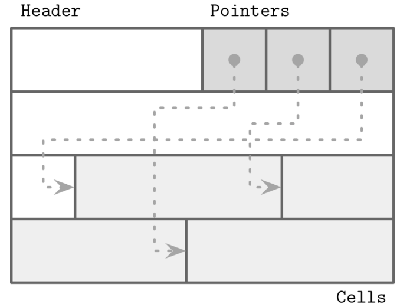
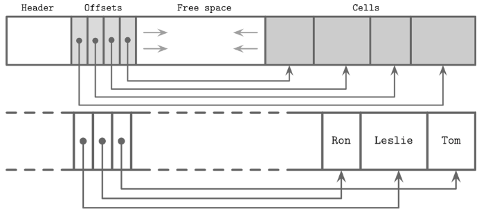

# Chapter 3: File Formats 
- Disk 사용 시 고려사항

## Binary Encoding 
- 메모리 접근: `malloc`, `free` 
- 디스크 접근: `read`, `write` 
### Primitive types 
- 고정 크기 
- edianness 
  - 컴퓨터의 메모리와 같은 공간에 바이트를 배열하는 방법 
    - Big edian: left to right 
    - Little edian: right to left 
### Strings and Variable-size data
- UCSD string or Pascal string 
  - string을 저장할 때 길이 정보를 함께 저장 
- null-terminated string 
  - null을 활용해 string의 종료지점을 식별 
  - 데이터 조회 시 Pascal string의 성능이 우수
### Bit-packed data: boolean, enums, flgs 
- Boolean 
  - single bit으로 표현 가능 
    - 1 byte을 모두 사용하는 것은 낭비 
    - 여러 boolean을 묶어 사용함 
- Enum
  - integer 형태로 표현할 수 있음 
- Flag 
  - boolean과 enum의 조합 

## General Principles 
- 디스크에 데이터를 저장 시, 그 format을 고정 크기 페이지를 활용  
  - 복잡도를 낮춤 
- File 
  - 고정 크기의 header, trailer을 사용 (빠른 접근을 위해)
  - header와 trailer 이외의 부분은 page로 구성됨 
- Page 구조 
  - 4 ~ 16KB 
  - B-tree의 노드는 1개 이상의 page로 구성됨 
### Slotted pages 
- 
- 가변 길이 데이터를 저장할 때 발생하는 fragmentation을 효과적으로 제거할 수 있음 
- 하나의 page를 slot or cell 단위로 나눔 
  - pointer을 활용해서 저장된 데이터의 순서와 위치를 식별할 수 있음 
  - 데이터의 삭제는 pointer을 nullify하는 형태로 수행 
- 장점 
  - overhead가 작다: slotted page의 오버헤드는 slot을 위한 저장공간과 slot을 관리하는 비용 뿐  
  - 공간 효율성이 높음. Defragmentation 과정이 쉬움 
  - Layout을 동적으로 수정 가능. Page를 사용하는 유저는 slot만 바라보기 때문에 내부 layout이 어떻게 변하든 slot이 잘 처리해주면 정상적으로 동작 
- offset, cell 
  - 
    - cell의 순서는 offset에서 관리 
### 가변 길이 데이터 
- Page에서 사용 가능한 cell을 나타내는 available list를 관리함 
  - 사용 가능한 page 내의 위치의 offset과 크기를 나타낸다 
- 사용 가능한 위치를 찾을 때 사용하는 알고리즘 
  - first fit
    - 가장 처음 발견된 사용 가능한 위치에 데이터를 저장  
  - best fit 
    - 낭비 공간이 최소화되는 위치에 데이터를 저장 
### Versioning 
- 파일의 binary format이 변경될 수 있음(breaking changes etc)
  - Apache Cassandra는 파일명에 version prefix를 활용 
  - PostgreSQL은 version을 저장하는 별도의 파일을 가짐 
  - Index file header에 version을 직접 명시하기도 함 
### Checksum
  - Checksum 또는 CRC를 활용해서 데이터의 무결성을 검증할 수 있음 
  - File 단위로하면 checksum 계산 비용이 너무 커짐 -> 작게 분할된 page 단위로 검증하는게 실용적  
