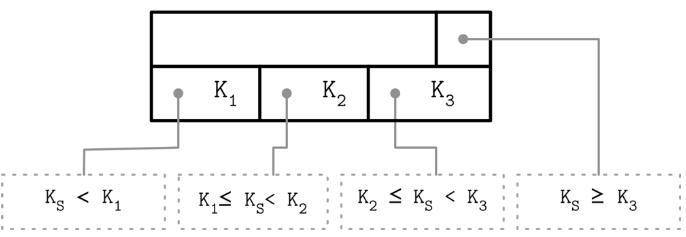
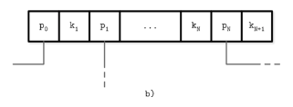
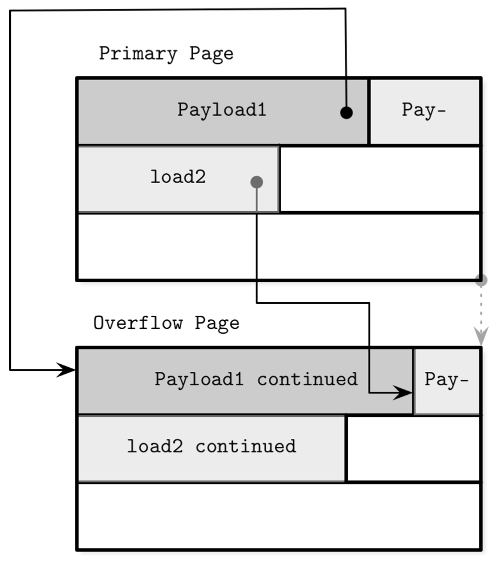
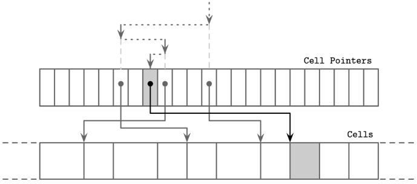
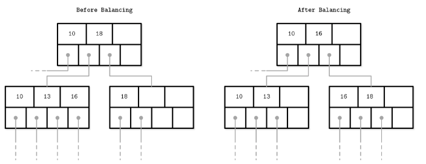
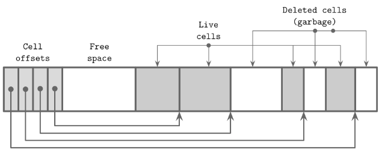

# Chapter 4: Implementing B-Trees 
## Page Header  
- Page의 메타데이터를 저장 
  - navigation, maintenance 용도로 사용 
- PostgreSQL 
  - header에 page size, layout version 등을 저장 
- MySQL InnoDB  
  - Heap record의 수, level, implementation specific detail 등을 저장 
    - 여기서 말하는 heap은 heap organized table에서의 heap 
### Magic numbers
- 어떤 유형의 page인지 식별할 수 있는 수단 
- validation, sanity check 등에 사용 
### Sibling Links 
- left or right sibling node를 가리키기 위해서 사용됨 
  - sibling node를 찾기 위해 parent node를 탐색할 필요가 없음 
- split하는 과정에서 복잡도가 증가한다는 단점이 존재함 
- sibling node를 빠르게 찾을 수 있다는 장점이 존재 
### Rightmost pointers 

- child node를 가리키는 node의 수는 key + 1 
- rightmost pointer을 별도로 저장 - 어떠한 키와도 매칭되지 않기 때문 
### Node with high key 

- subtree에서 사용할 수 있는 가장 큰 key 값을 node의 오른쪽에 추가 
- PostgreSQL B_link tree에서 사용됨
### Overflow pages 
- 여러 page를 linked page 형태로 사용함으로써 사이즈가 큰 데이터를 저장할 수 있음 

- PostgreSQL overflow page: [TOAST](https://www.postgresql.org/docs/15/storage-toast.html)

## Binary search 

- 데이터가 위치한 cell을 찾을 때 binary search(정렬됐기 때문)

## Split과 Merge propagation 
- child node의 split, merge 이후 parent node에 저장된 pointer도 업데이트가 필요함 (propagation)
  - cf) WiredTiger은 leaf node traversal 시 발생하는 deadlock을 피하기 위해서 parent pointer을 사용
- Breadcrumbs 
  - 이전에 방문한 node 정보를 저장(stack 등 자료구조를 활용), backtracking에 사용됨 
  - 용도 
    - node split이 발생 -> stack으로부터 가장 최근에 방문한 노드(parent node) 정보 추출(stack pop) -> parent node에 child node 변경사항 반영 
- Rebalancing 
  - 
  - split, merge를 수행하는 대신 데이터가 많이 저장된 노드로부터 데이터가 적게 저장된 노드로 데이터를 이동 
  - B*-Tree
    - 양쪽 sibling 노드가 꽉 찰때까지 rebalancing을 수행 

## Right-only appends 
- Primary key 
  - 단조 증가하는 primary key를 사용한다면 해당 key는 항상 B-tree의 가장 오른쪽에 추가됨 
  - PostgreSQL 
    - 위 상황을 fastpath라 부름 
    - B-tree에 데이터를 insert하기 위해 필요한 이전 단계는 모두 skip -> B-tree의 가장 오른쪽에 바로 추가 
- Bulk loading 
  - 저장하고자 하는 데이터가 이미 정렬된 상태라면 -> bulk loading 
  - B-tree를 bottom -> up 방식으로 만들 수 있음 

## Vacuum and Maintenance 
- slotted page defragmentation과 같이 clean up이 필요함 

- garbage: non-addressable data records: cell을 가리키는 cell offset pointer이 없는 경우를 의미함 
- MVCC가 적용되는 경우: garbage 데이터를 참조하는 트랜잭션이 더 이상 없을때까지 기다렸다 garbage collection을 진행한다. 

