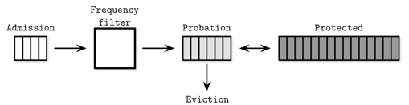

# Chapter 5. Transaction Processing and Recovery 
## Transaction 
- DBMS에서 분리할 수 없는 논리적인 작업 단위 
- ACID 
  - Atomicity 
    - 분리할 수 없는 특성 
  - Consistency 
    - Application과 database가 함께 동작해야 일관성이 유지됨 
  - Isolation 
    - 동시에 실행되는 트랜잭션끼리 서로 간섭없이 수행될 수 있도록하는 특성 
    - Isolation level에 따라 트랜잭션간 간섭의 정도가 달라짐 
  - Durability 
    - 커밋된 트랜잭션은 디스크에 영구저장돼야함 
- 트랜잭션과 관련된 요소
  - Transaction manager
    - 트랜잭션간 스케쥴링과 조율 등을 담당 
  - Lock manager 
    - 데이터 정합성을 저해할 수 있는 상황을 방지하기 위해 잠금을 사용 
  - Page cache 
    - 디스크와 storage engine 중간에 위치해서 캐시기능을 제공 
  - Log manager 
    - 데이터베이스에서 수행된 작업을 기록하는 로그 
    - redo, undo에 사용됨 

## Buffer Management 
- Page cache와 Buffer pool이라는 용어는 종종 같은 의미로 사용됨 
- Page cache 기능 
  - 페이지를 메모리에 저장 -> 캐싱된 페이지의 접근 속도 향상  
  - 페이지의 수정사항을 디스크에 반영하기 전 버퍼링을 통해 성능을 향상 
  - 페이지 eviction 알고리즘을 통해 중요도가 낮은 페이지를 메모리에서 제거 
- O_DIRECT 
  - I/O system call을 사용할 때 kernel page cache를 거치지 않도록하는 flag 
    - kernel을 거치지 않고 DB에 최적화된 buffer management를 사용하기 위해 사용됨 
  - 단점 
    - 동기적으로 처리됨 
    - kernel에서 제공하는 최적화를 사용불가: read ahead 등
- Caching 
  - 디스크에 저장된 데이터를 수정할 수 있는 프로세스가 단 1개라면, cache <-> disk 싱크가 비교적 단순 
    - 만약 분산환경에서처럼 디스크에 저장된 데이터를 수정할 수 있는 프로세스가 여러개라면 싱크 작업이 복잡해짐 
  - Pinning 
    - 메모리에 로드된 page가 evict되지 않도록하는 방법 
    - B-Tree의 경우 상위 레벨의 노드일수록 자주 접근됨 -> 상위 노드를 pinning했을 때 성능 향상에 도움 
  - Dirty 
    - 메모리에 로드된 page가 수정된 경우, dirty page라고 부름 
- Page replacement 
  - FIFO, LRU 
    - FIFO: queue를 사용해서 first in first out 
    - LRU: 2Q LRU, LRU-K 등 
  - Clock 
    - 정확도보다는 효율을 추구 
    - 동작원리 
      - 시계의 시침 처럼 page를 가리키는 포인터가 시계방향으로 이동
      - page access bit가 이미 1인 경우 
        - page가 참조되지 않는 경우: page access bit을 0으로 수정 
      - page access bit가 이미 0인 경우 
        - page가 참조되지 않는 경우: scheduled for eviction 
  - LFU
    - TinyLFU
      - Frequency based eviction policy
      - Java Caffeine을 활용해서 구현 
    - 3개의 queue가 존재 
      - 
      - Admission: 새로 추가된 페이지를 저장 
      - Probation: 제거될 가능성이 높은 페이지를 저장 
      - Protected: 큐에 오래 저장될 가능성이 높은 페이지를 저장 

## Recovery 
- WAL(Write Ahead Log)
  - 데이터베이스 crash에 대비하기 위해 사용되는 로그성 파일 
  - e.g. MySQL redo log 
  - WAL 기능 
    - page에 변경사항을 바로 반영하기 전에 log 성 파일에 미리 저장함으로써 buffering 기능 제공 
    - 데이터베이스 crash가 발생하더라도 WAL를 통해 crash 이전 상태를 복원할 수 있음 
  - ARIES(Algorithm for Recovery and Isolation Exploiting Semantics): 복구 알고리즘 
  - Checkpointing 
    - WAL에 존재하는 로그 중 디스크의 page에 반영이 완료된 로그를 삭제하는 작업 
- Log Semantics 
  - LSN(Log Sequence Number)
    - 단조 증가, 로그별로 유일한 값 
    - 로그를 저장하는 과정에서도 log buffer을 통해 최적화를 진행 
      - log buffer -> log(WAL) -> page 
      - log buffer의 데이터는 force 작업 시 디스크의 log에 반영됨 
        - force 수행 시점 
          - log buffer가 꽉차거나 
          - transaction manager가 force 작업을 호출하거나 
      - transaction은 관련된 작업이 디스크에 반영되지 않으면 commit된게 아님 
  - CLR(Compensation Log Records)
    - 데이터베이스 복구 중 recovery 작업을 수행하는 과정에서도 별도의 로그를 기록 -> CLR
    - 복구 과정에서 다시 크래시가 발생할 때 CLR을 통해 복구 
  - Checkpoint
    - log에서 실제 disk에 반영된 영역을 표시하는 작업 
  - Fuzzy checkpoints 
    - Checkpointing 작업 시 로그의 모든 작업을 한번에 디스크의 page에 반영하면 작업을 처리하느라 유저 입장에서 갑작스런 데이터베이스 중지가 발생할 수 있음 
    - begin_checkpoint ~ end_checkpoint 를 활용한 fuzzy checkpoint를 활용해 로그를 반영하는 작업을 작게 나눠서 수행 
- Logical VS Physical logging 
  - Logical: 논리적 작업을 로깅 
  - Physical: 실제 수정된 데이터를 로깅 
  - 데이터베이스는 위 두 방식을 혼용해서 사용 
- Steal / Force 정책
  - 데이터베이스 복구와 관련해서 자주 등장하는 주제  
  - steal / no-steal 
    - steal: 복구 메카니즘 중 커밋되지 않은 트랜잭션의 작업이 디스크에 반영될 수 있음을 의미 
    - no-steal: 커밋되지 않은 트랜잭션의 작업은 디스크에 반영될 수 없음
      - no-steal 정책을 사용하는 경우 복구 과정에서 redo log만 사용하면 됨. 커밋되지 않은 데이터는 디스크에 반영될 수 없기 때문 
  - force / no-force 
    - force: 모든 변경사항이 디스크에 반영돼야 트랜잭션이 커밋됨  
      - 데이터베이스 복구 과정에서 트랜잭션의 작업 사항을 디스크에 반영하는 별도의 작업이 필요 없음. 이미 커밋된 트랜잭션의 변경사항은 모두 반영됐기 때문 
    - no-force: 모든 변경사항이 디스크에 반영되지 않더라도 트랜잭션을 커밋할 수 있음
      - 변경사항을 버퍼링할 수 있음 
- ARIES
  - steal/no-force 복구 알고리즘 
  - WAL을 활용해서 
    - committed, uncommitted 트랜잭션에 의한 작업을 모두 재실행 
    - uncommitted 트랜잭션의 작업은 undo
  - 동작 순서 
    1. Analysis phase
       - crash 당시 실행중인 트랜잭션, dirty page 등을 식별 
    2. Redo phase 
       - 커밋 또는 커밋되지 않은 트랜잭션과 관련된 모든 작업을 실행 
    3. Undo phase 
       - 커밋되지 않은 데이터 rollback 
       - 복구 과정에서 다시 crash 되는 경우를 대비해서 undo 작업에 사용된 로그도 기록됨 

## Concurrency Control 
- transaction manager, lock manager이 함께 동작
- Concurrency control 방법 개요 
  - OCC(Optimistic Concurrency Control)
    - 일단 트랜잭션들이 동시에 실행되는것을 허용함 
    - 트랜잭션 커밋 시점에 충돌하는 트랜잭션이 있으면 그 중 하나를 abort
  - MVCC(MultiVersion Concurrency Control)
    - 특정 트랜잭션이 실행되는 시점을 snapshot 처럼 찍어서 사용 
    - scheduling, lockless(timestamp ordering) 또는 lock based(2PL) 방법을 활용해 구현할 수 있음  
  - PCC(Pessimistic Concurrency Control)
    - 트랜잭션이 실행되는 시점에 트랜잭션간 충돌이 있는지 확인 
    - lockless 
      - read, write list를 관리해서 트랜잭션이 데이터에 접근하는걸 관리 
    - lock-based 
      - 트랜잭션이 접근하는 데이터에 lock을 걸어서 충돌을 방지 
- Serializability 
  - schedule 
    - 다수의 트랜잭션을 실행하기 위해 필요한 작업(operation)의 순서 
    - 작업(operation)이란 ? 
      - 데이터베이스의 상태에 영향을 주는 작업 
      - read, write, commit, abort 
  - complete schedule 
    - schedule에 포함된 transaction에 포함된 모든 작업이 수행되는 스케쥴 
  - serial
    - schedule에 포함된 transaction의 작업이 교차하지 않고 실행된 경우를 의미 
    - 말그대로 transaction이 순차적으로 실행됐을 때
  - serializable schedule 
    - serial schedule의 실행결과와 동일하다고 간주할 수 있을 때, 해당 schedule을 serializable schedule이라고 부름 
## Transaction Isolation 
- isolation level 
  - transaction간 얼마나 격리돼있는지를 결정 
  - 서로 영향을 주지않는 트랜잭션은 어떤 순서로 실행되어도 문제 없음 
- Read anomalies 
  - dirty read 
    - 커밋되지 않은 데이터를 읽음 
  - nonrepeatable read 
    - 하나의 트랜잭션에서 동일한 데이터를 두 번 이상 읽었을 때 결과가 다른 현상  
  - phantom read 
    - 하나의 트랜잭션에서 동일한 범위 쿼리(range query)를 수행 시 결과가 다른 현상  
- Write anomalies 
  - lost update 
    - 다수의 트랜잭션이 동일한 데이터에 쓰기 작업 수행 시 발생 
  - dirty write 
    - 커밋되지 않은 데이터를 대상으로 쓰기 작업 수행 시 
  - write skew 
    - 각각의 트랜잭션은 특정 작업을 할 수 있는 조건을 만족하지만, 트랜잭션이 동시에 실행 시 해당 조건을 위배 
    - e.g. meeting room 
- snapshot isolation 
  - 해당 트랜잭션이 실행된 시점의 snapshot -> 해당 트랜잭션이 실행되는 도중에는 변경되지 않음  
  - 해당 트랜잭션의 작업이 다른 트랜잭션의 작업과 충돌하는 경우 -> 하나만 성공적으로 커밋 
  - write skew는 여전히 발생 가능 
## Concurrency Control 방식 
- OCC 
  - 트랜잭션이 수행되는 도중에 lock을 통해 미리 충돌을 방지하는게 아닌, 최종 커밋 시점에 충돌을 감지 
  - 원리 
    1. 읽기 단계: 해당 트랜잭션의 컨텍스트에서 작업을 수행 
    2. 검증 단계: 다른 트랜잭션과 충돌하는 작업이 있는지 확인 
      - backward-oriented validation: 이미 커밋된 트랜잭션 작업의 결과와 검증을 진행  
      - forward-oriented validation: 커밋되지 않은, 실행중인 트랜잭션 작업의 결과와 검증을 진행 
    3. 쓰기 단계: 검증이 완료된 경우 커밋을 위한 작업 수행 
- MVCC 
  - multiple record version + TX ID(단조증가)
  - snapshot isolation에서 주로 사용됨 
- PCC 
  - 트랜잭션이 실행되는 도중에 충돌을 감지 
  - lock-free 
    - timestamp ordering 
    - 각 트랜잭션은 timestamp를 지님 
    - transaction manager에서 record별로 max_read_timestamp, max_write_timestamp를 보관 
    - 다음 상황에서 abort
      - 읽기 작업을 수행하려는 tx's timestamp < 읽기 대상 데이터의 max_write_timestamp : 트랜잭션이 실행되는 도중 다른 트랜잭션이 쓰기 작업을 commit함 
      - 쓰기 작업을 수행하려는 tx's timestamp < 쓰기 대상 데이터의 max_read_timestamp : 트랜잭션이 쓰기 작업을 수행하려는데 해당 데이터를 참조하는 트랜잭션이 존재함 
    - 쓰기 작업을 수행하려는 tx's timestamp < 쓰기 대상 데이터의 max_write_timestamp
      - Thomas write rule으로 인해 abort 하지 않음 => 해당 트랜잭션의 쓰기 작업은 무시됨 
  - lock-based 
    - 2PL 
      - growing phase: 트랜잭션에 필요한 잠금을 획득하는 단계(잠금을 해제하지 않음)
      - shrinking phase: 잠금이 해제되는 단계
## Deadlocks 
- Deadlock을 해소하는 방법 
  - timeout 
  - 오랜시간 실행중인 transactions을 abort 
- Deadlock 감지 
  - waits-for graph(트랜잭션간 의존성 그래프) 
- Deadlock 발생 시 어떤 트랜잭션을 abort? 
  - Wait-die 
    - higher timestamp를 지닌 tx만이 현재 트랜잭션을 blocking할 수 있음 => 상대적으로 미래에 수행된 트랜잭션에 의해서 현재 트랜잭션이 blocking
  - Wound-wait 
    - lower timestamp를 지닌 tx만이 현재 트랜잭션을 blocking할 수 있음 => 상대적으로 과거에 수행된 트랜잭션에 의해서 현재 트랜잭션이 blocking 
## Locks vs Latches  
- Locks 
  - 논리적 잠금 
- Latches 
  - 물리적 잠금
  - system programming에서는 lock이라고 지칭함 
  - page 단위 잠금은 latch라고 부름 
- Reader-Writer lock 
  - read, write 작업에 다라 lock이 다름 
  - busy wait, queueing technique 
- Latch crabbing 
  - latch가 필요없는게 확인되면 이전에 획득한 latch를 해제 
  - B-Tree에서 그 과정이 crab의 이동과 유사 
