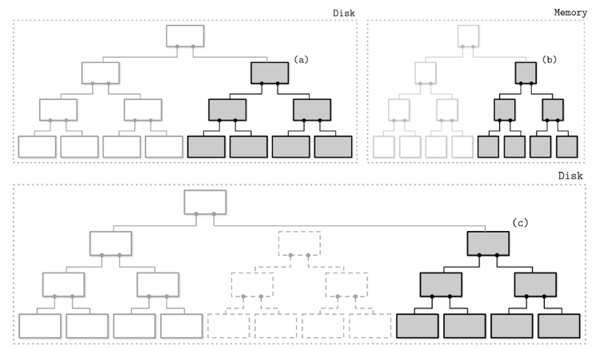
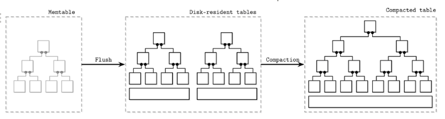
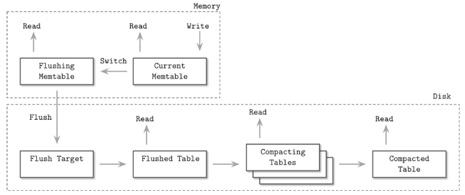
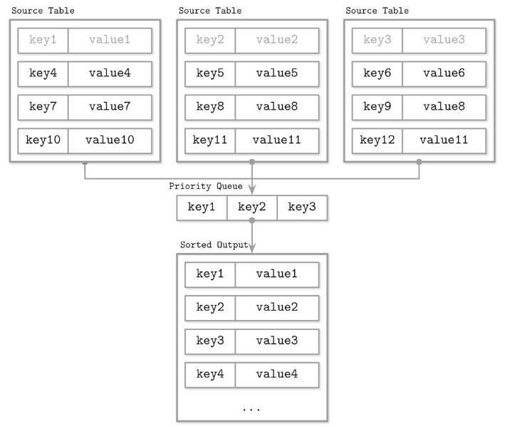
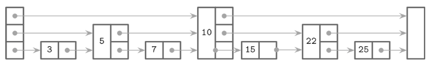
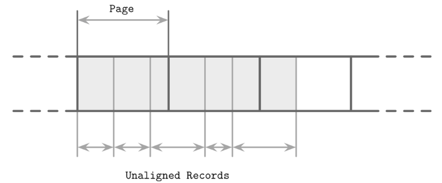
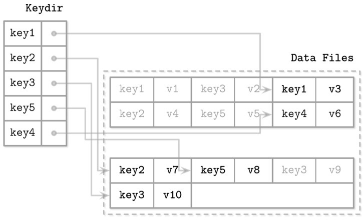
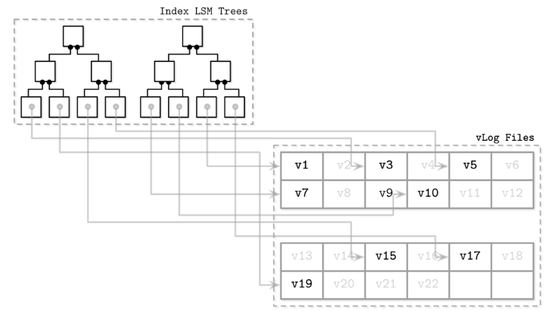

# Log Structured Storage 
- In-place update VS Append-only 
  - In-place update
    - 읽기 비용이 상대적으로 적음 
    - 쓰기 비용이 상대적으로 큼 
  - Append-only storage 
    - 읽기 비용이 상대적으로 큼 -> 동일 데이터의 여러 버전을 읽어야 함 
    - 쓰기 비용이 상대적으로 적음 
## LSM Trees 
- 모든 쓰기작업은 로그에 수행 
- 특징 
  - 메모리 상의 테이블에 쓰기 데이터를 버퍼링 
  - 쓰기 작업이 읽기 작업보다 많을 때 유용 
  - 쓰기 작업와 읽기 작업이 간섭하지 않음 
    - 별로의 잠금이 필요 없음
  - 로그를 정리하는 작업이 필요함
### LSM Tree Structure 
- 삽입 순서를 유지하는 여부에 따라 구분 
  - Ordered LSM Tree 
  - Unordered LSM Tree 
- Memtable 
  - 메모리 상의 테이블
  - 가변 자료구조 
  - 버퍼링의 역할 
  - 읽기와 쓰기 작업이 수행되는 곳 
  - 특정 임계치 이상으로 넘어가면 디스크 쓰기가 수행 
  - 별도의 WAL 로그를 통해 durability 보장 
  - cf) 디스크에 저장된 데이터는 읽기 전용 
- Two-component LSM Tree 
  - 
  - disk의 자료구조는 B-Tree, 100% node occupancy + read only page 
  - memtable은 전부가 아닌, 부분적으로 disk flush 
  - flush 이후 변경이 수행된 memtable과 disk의 subtree는 제거됨 
  - merge sort와 유사한 방법으로 memtable과 disk의 subtree 병합을 진행 
  - 실제 프로덕션 환경에서 사용되는 데이터베이스가 있는지는 모름 -> merge가 흔해서 write amplification이 자주 발생 
- Multicomponent LSM Tree 
  -  
  - 1개 이상의 disk resident tables를 가짐 
  - 압축(compaction)
    - 압축 대상 테이블을 선정해서 병합하여 새로운 파일에 저장 
    - 병합된 새로운 테이블이 생성되면 기존 테이블은 제거됨 
- In-memory tables 
  - memtable flush 과정에서 원자성이 보장돼야하는 작업: 
    - 새로운 memtable로의 switching 작업 
    - old memtable이 flushing state로 변경되는 작업 
  - 
    - Current memtable: 읽기와 쓰기 작업이 수행되는 대상 
    - Flushing memtable: 읽기 작업은 가능 
    - On-disk flush target: flushing 중이므로 읽기 작업에 사용되지 않음 
    - Flushed tables: Flushed memtable이 제거되는 순간 읽기에 사용될 수 있음 
    - Compacting tables: disk resident table을 병합중인 테이블 
    - Compacted tables: 압축 이후 테이블 
- Updates and Deletes 
  - delete의 경우 tombstone을 활용 
  - range tombstone 
    - Cassandra에서 활용 
- LSM Tree Lookups
  - 하나의 데이터를 확인하기 위해서 다수의 데이터를 확인해야함 (심지어 여러 컴포넌트에 위치)
- LSM Merge Iteration 
  - 
  - priority-queue를 활용(크기는 `N`)
  - value와 함께 iterator를 pq에 저장
-  Reconciliation 
  - priority queue에서 동일한 key의 경우 -> reconcile 대상 -> upsert 
  - timestamp를 활용해 최신값을 식별 
- LSM Tree Maintenance 
  - 주기적인 압축을 통해서 로그를 관리 
  - Leveled compaction 
    - disk resident table을 레벨별로 구분한다(level-0, level-1 ....)
    - 각각의 level은 index number와 target size가 지정됨 
      - level-0은 memtable로부터 가장 최근에 생성된 테이블, overlapping key를 가질 수 있음 
      - level-0의 크기가 임계치를 초과하면 다음 level과 병합됨 
      - level-1 이상의 level에서는 key가 겹치지 않음 
  - Size-tiered compaction
    - size를 기반으로 grouping 
    - level 0
      - 가장 작은 크기의 테이블 
      - memtable flush 또는 compaction으로 인해 생성됨 
    - table starvation 
      - 상황에 따라 higher level table에 compaction이 덜 수행될 수 있음 
      - higher level table의 읽기 비용이 큼

### Read, Write and Space Amplification 
- Read amplificaton 
  - 압축 과정이 덜 된 경우 발생 
- Write amplification 
  - 압축 과정에서 새로운 파일로 쓰기 작업을 수행할 때 발생 
### Run Conjecture(어림짐작)
- Run conjecture은 `read`, `update`, `write` 작업 중 2 작업의 비용을 감소시키는 경우 나머지 하나 작업의 비용이 크다고 말함 
  - 데이터베이스에 필요한 다양한 요소를 고려하지 않았다는 한계가 있음 

## Implementation Details 
### Sorted String Tables(SSTables)
- Disk resident table을 구현 시 활용
  - key order로 저장 
- Immutable 
- SASI(SSTable-Attached Secondary Index) 
  - Cassandra에서 사용 
  - Primary key 이외에도 다른 필드를 통해 인덱싱이 가능
  - SSTable별로 인덱스가 생성됨 
### Bloom Filters 
- LSM Tree의 특성상 존재하지 않는 데이터를 읽으려 하면 read amplification이 발생함
- 데이터의 존재 여부를 식별할 수 있는 확률형 자료구조 
- false-negative는 발생하지 않음 
  - bloom filter야 `A`라는 데이터 존재하니? -> Bloom filter: 없습니다 
    - 위 상황이 거짓(false)가 될 수 없다는 뜻 
  - 즉 bloom filter 질의의 결과가 "데이터 없음"인 경우 항상 데이터가 없음을 알 수 있다 
- bit array + multiple hash function을 활용해서 구현 
- 다른 확률형 자료구조 
  - HyberLogLog(cardinality estimation)
  - Count-Min sketch(Frequency estimation)
### SKiplist 

- 동작 원리 (7을 찾는다 가정)
  - Highest level에서 시작 -> 10 -> 7과 비교했을 때 10이 더 크니 한 단계 아래로 이동 
  - Middle level 시작 -> 5 -> 7과 비교했을 때 5가 더 작으니 수평 이동 -> 10 -> .. -> 한 단계 아래로 이동 
  - 3 -> 5 -> 7
- Apache Cassandra의 secondary index memtable 구현에 사용됨 
### Disk Access 
- Immutability 특성 덕에 lock이 필요하지 않음
- 
- LSM tree의 data record는 page에 완전히 정렬되지 않을 수 있음 
  - 따라서 page ID 대신 absolute offset을 가리키는 pointer을 활용 

## Unordered LSM Stroage 
### Bitcask 
- Riak에서 활용 
- memory를 활용한 버퍼링을 하지 않음 -> logfile을 다이렉트로 저장함
- 
  - memory 자료 구조(hashmap) 
  - 특정 키에 대해 최신 값을 보유한 data file의 위치를 가리킴 
  - compaction 과정에서 old data는 제거됨 
  - 읽기 
    - keydir에서 key에 대응되는 pointer을 통해 조회 
  - 쓰기 
    - logfile에 데이터를 쓰고 keydir의 pointer을 업데이트 
### WiscKey 

- range scan이 가능 
- sorted LSM tree(index) + vLog(unordered append-only files)
  - sorted LSM tree는 인덱스 용도라 데이터파일에 비해 크기가 작고 압축 효율이 좋음 
  - vLog의 unordered 특성상 random I/O가 발생 

## Concurrency in LSM Trees 
- main challenge 
  - 구조 변경 시 (switching table, log synchronization)
  - memtables (동시 접근이 많기 때문)
