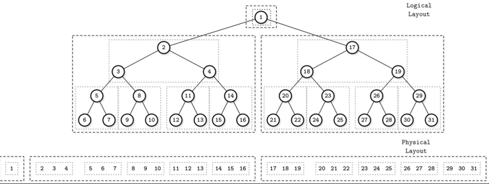

# Chapter 6. B-Tree Variants 
- Variants 
  - copy-on-write B-Tree 
  - lazy B-Tree 
  - FD-Tree 
  - Bw-Tree 
  - Cache-oblivious B-Tree 

## Copy-on-Write B-Tree 

- 변경사항은 복사본을 만들어서 수행 
  - 읽기 작업은 old tree에서 
  - 쓰기 작업은 new tree에서 
- 장점
  - 읽기 작업간 동기화가 필요없음 (latching 불필요)
- 단점
  - 추가적인 공간
  - 복사 과정에서 발생하는 추가적인 cpu 프로세싱 
- 구현체 
  - LMDB(Lightning Memory-Mapped Database)
    - key-value used by OpenLDAP 
    - 구/신 version root node(총 2개)가 존재 

## Lazy B-Trees 

- 변경사항을 버퍼링 
- 디스크에 저장되기 전 reconciliation 수행 
- 읽기 작업은 버퍼에 저장된 변경사항을 모두 반영시킨 결과를 읽음 
## Lazy-Adaptive Tree 

- 개별 노드별로 버퍼를 유지하는게 아닌, node를 묶어서 sub-tree 단위로 관리

## FD-Tree(Flash-Disk Tree)
- Append only storage를 활용해 모든 노드를 대상으로 변경사항을 버퍼링 
- 구성 
  - mutable head tree 
    - a small B-Tree buffering the updates 
  - immutable sorted runs 
    - head tree의 저장공간이 꽉 차면 immutable run으로 데이터를 전달 
    - immutable run의 크기가 임계치를 넘어가면 다음 레벨의 immutable run과 병합됨 
- Fractional cascading 
  -  
  - run 간 pointer을 저장 -> 여러 level에서 element를 찾을 때 검색속도를 높이기 위한 방법 
  - run간 shortcut(bridge)을 만듬 

## Bw-Trees(Buzzword-Tree) 

- Append only 저장소를 활용해 batch update
- Node를 chain으로 연결
  - delta node(변경사항을 저장)
  - 읽기 시점에는 모든 delta가 반영된 결과를 읽음 

## Cache-Oblivious B-Trees 
- 사용되는 메모리 구조와 상관없이 최적의 성능을 낼 수 있도록 설계된 B-Tree 
- van Emde Boas Layout 
  -  
  - B-Tree를 재귀적으로 나눠고, 나눠진 영역별로 연속되는 공간에 저장 
  