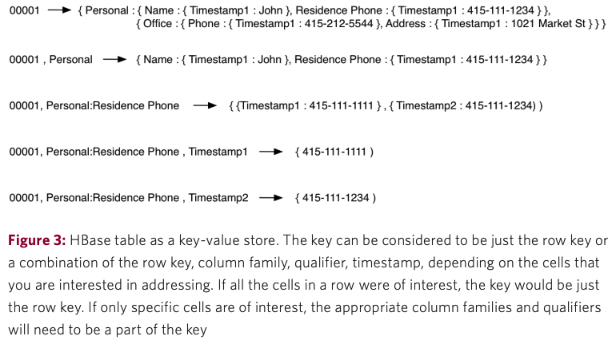
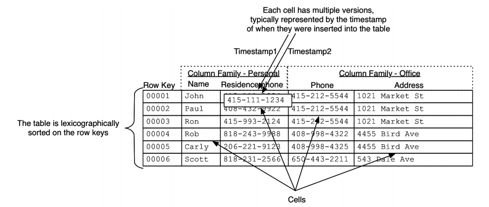
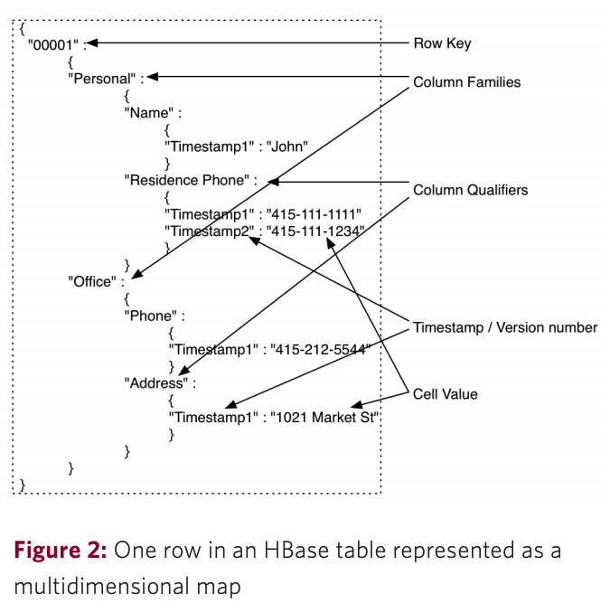
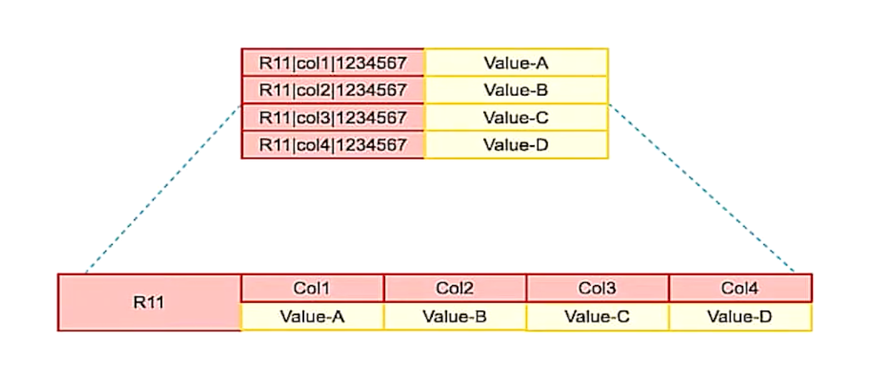
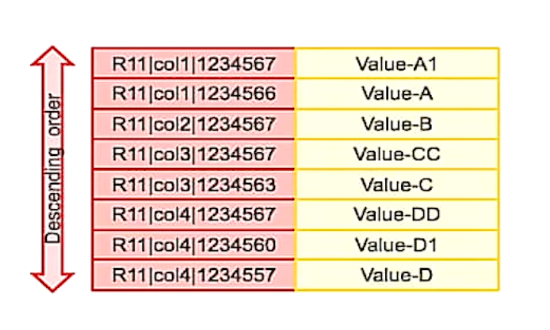
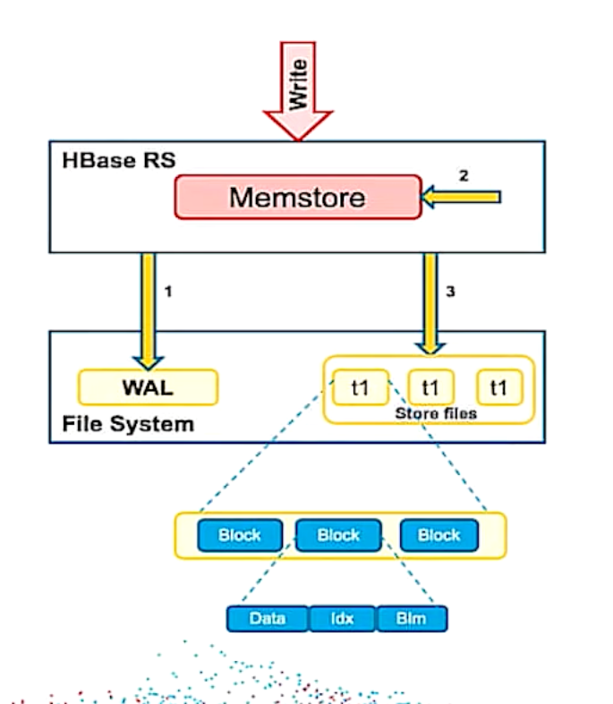
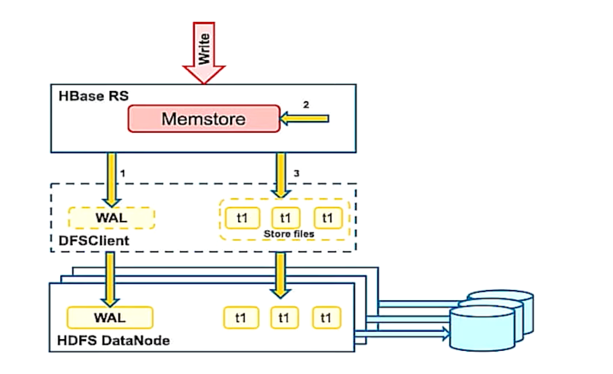
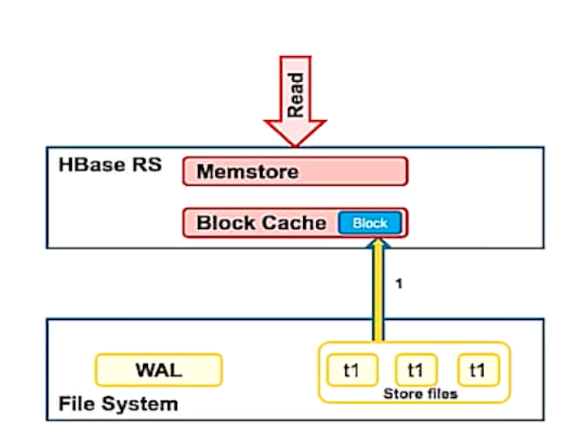
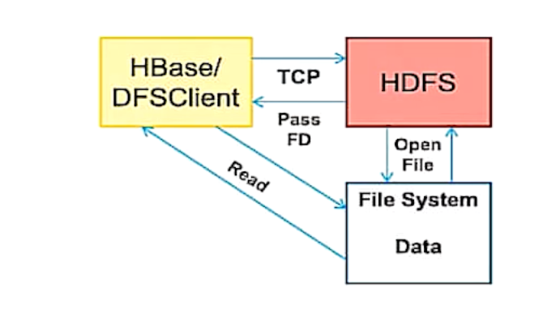
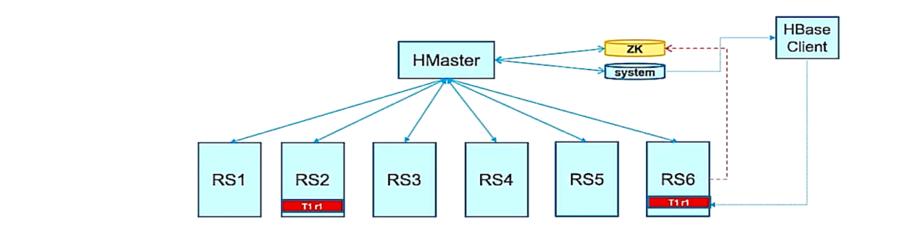

# HBase 
- 특징 
  - Column-oriented, non-relational database management system that runs on top of HDFS 
  - key-value store 
    - 
  - 대용량 데이터에 대한 real-time data processing, random read/write 성능이 우수함 
  - RDBMS와 같은 structural query를 지원하지 않음 
    - Apache Avro, REST, Thrift를 활용해 HBase를 활용할 수 있음 
  - 수평 확장이 가능 
    - Zookeeper을 통해 coordination 
    - Hive(query engine)를 활용해 batch processing이 가능 
  - 모든 데이터를 byte array로 저장할 수 있어 유연하다 
  
- 구성 
  - 
  - 
  - Table
    - 이름은 문자열 
    - 파일 시스템에서 안전하게 쓰일 수 있는 문자 조합으로 구성 
  - Row 
    - 테이블에서 데이터 저장의 단위 
    - row key를 통해 데이터를 유일하게 식별 
    - data type이 없고 byte array로 저장 
    - 테이블은 row key를 기반으로 정렬되어 저장된다.
      - 테이블의 각 region은 row key의 일부 공간을 담당하며, start와 end rowkey에 의해 식별된다. 
      - region은 start key에서 end key까지 정렬된 rowkey 리스트를 지닌다. 
    - 원자성을 보장하는 단위 
      - multi-row 트랜잭션을 보장하지 않는다 
  - Region 
    - 테이블 내에 연속적인 row들의 집합
      - RDBMS의 shard와 유사함 
    - HBase table은 다수의 region으로 horizontal partition됨 -> 각 region은 HBase cluster의 region server에 의해 관리됨  
    - 분산 및 병렬처리를 위한 장치 
    - HBase는 확장성과 성능을 위해 자동으로 region을 분리 -> 데이터가 적으면 merge도 가능  
      - region이 분리되는 기준을 설정할 수 있음 
    - region을 저장하고 처리하는 서버를 region server라고 부름 
  - Column family
    - row내 column은 column family 단위로 묶임 
    - 물리적인 데이터 저장에 영향을 준다 => 미리 정의해야하며 수정이 어려움 
    - 테이블 생성 시 정의됨 
  - Column qualifier 
    - column family 내에서 column을 식별하는 데 사용 
    - 동적으로 정의됨(write 시점)
  - Cell
    - 
    - row key, column family, column qualifier의 조합은 cell을 유일하게 식별함 
    - cell에 저장된 데이터를 value라고 부르며 byte array 형태로 저장된다.
  - Timestamp
    - 
    - cell 내부의 value는 버전화된다.
 - Namespace 
   - RDBMS의 schema와 유사한 개념 
   
- Operation 
  - GET / PUT
    - rowkey를 기준으로 데이터를 가져오는 연산 
    - timestamp versioning을 지원하지만 디폴트로는 가장 최근 버전만을 반환한다(쿼리를 통해 여러 버전을 요청할 수 있다)
  - SCAN
    - rowkey의 start와 stop을 제공하거나 start, stop이 없으면 테이블 전체를 스캔한다 

- HBase write 
  - 
    1. Region server에서 쓰기 요청 접수 
    2. WAL에 기록(file system)
    3. Memstore에 저장 
    4. Memstore가 가득차면 store file로 flush (data block, index block, bloom filter)
  - 
    - HDFS를 통해 replication -> 고가용성 보장
  - HBase compaction
    - 동일 키에 대한 중복, 삭제 등 작업을 반영  
    - minor / major compaction 
      - minor compaction: 작은 파일을 대상으로 압축을 진행 
      - major compaction: 특정 기준 이상의 파일을 압축 

- HBase read 
  -  
    - block cache: read cache 
    - block cache + memstore(변경사항이 있으면 반영) => read 결과
  - 
    - HDFS 사용 시 short-circuit read를 통해 네트워크 홉을 줄일 수 있음 

- HBase master 
  - 
  - Zookeeper을 활용해서 master 선출 

- ACID
  - Atomicity: row level 원자성
  - Consistent to a point in time before the request(읽기 작업 이후에는 어떤 변경이 발생할지 모름)
  - Isolation through MVCC(reads) and row locks(mutations)
  - Durability is guaranteed for all successful mutations 
# Reference 
- http://0b4af6cdc2f0c5998459-c0245c5c937c5dedcca3f1764ecc9b2f.r43.cf2.rackcdn.com/9353-login1210_khurana.pdf
