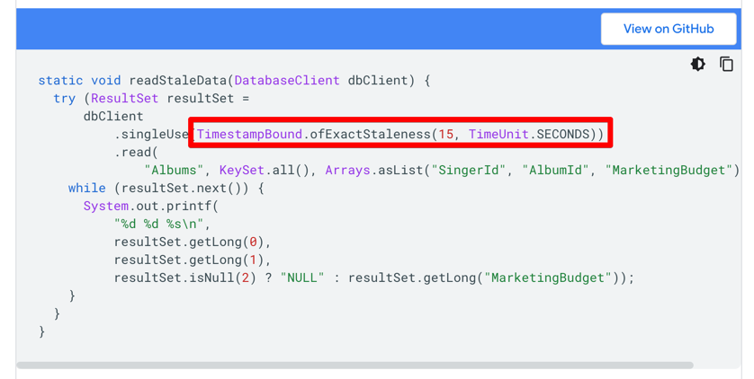
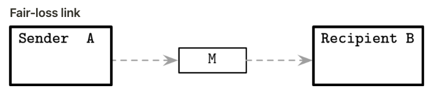
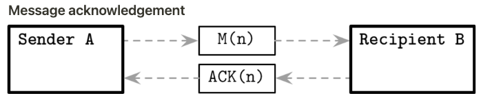
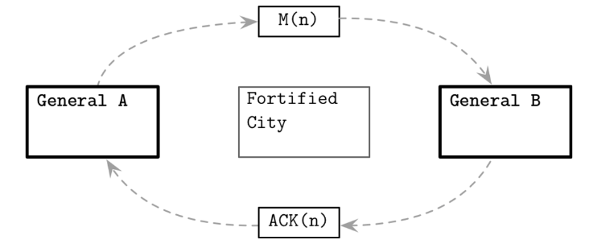
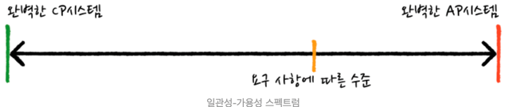
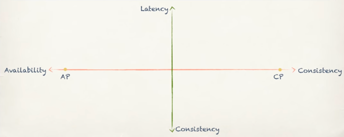
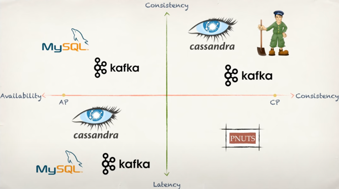

# Chapter 8. Introduction and Overview 
## Distributed Computing 에서 주의할 점 
- Latency 
  - 0이 아님
  - 서버의 processing 과정에서도 추가적인 latency가 발생할 수 있음 (즉각 처리되는게 아님)
- Bandwidth 
  - 무한대가 아님
- Clocks and Time
  - 서로 다른 node의 clock이 정확하게 동기화 X 
  - Google spanner 
    - special time API를 제공 
    - uncertainty bound를 지닌 timestamp 결과를 리턴
      - 
- State consistency 
  - distributed 알고리즘은 상태 일관성을 항상 제공하지는 않는다. 따라서 다양한 방법을 활용하여 상태 일관성을 유지하려고 노력  
  - conflict resolution 
    - 분기된 상태를 시스템에서 해결하는 방법 
  - read-time data repair 
    - read 시점에 데이터를 repair하는 방법
- remote call은 local function call과 다름 
- node는 언제나 다운될 수 있음 
  - heartbeat protocol, failure detector을 통해 노드의 상태를 감지 
- network partition 발생 가능성  
  - 2대 이상의 노드간의 통신이 불가능한 상태 
- cascading failure 
  - 한 노드의 장애가 다른 노드의 장애를 유발하는 경우
  - retrying은 상황을 악화시킬 뿐 -> circuit breaker  
  - jitter 
    - retrying 시간을 랜덤하게 설정하여 cascading failure를 방지

## Distributed System Abstraction 
### Fair-loss link 

- 가능한 Message M의 상태 
  - A로부터 송신됐지만 B에서 아직 수신하지 못한 상태 
  - 유실 
  - B에서 성공적으로 수신 
- 송신하는 측에서 메시지의 상태를 모르는 구조를 fair-loss link라고 함
- Fair-loss link의 특징 
  - 메시지를 계속 송신하면 언젠가는 수신측에서 메시지를 수신 
  - 동일한 메시지가 중복 송신될수는 있지만 무한으로 중복 송신되지는 않음
  - 송신되지 않은 메시지가 뿅하고 생성될 수 없음
### Message Acknowledgement

- 수신측은 메시지 수신을 송신측에 알리는 형태 
- Retransmit 
  - ACK 메시지를 수신하지 못하는 경우 송신측은 retransmit을 수행 
  - retransmit의 문제는 동일 메시지가 중복으로 송신될 수 있음 -> idempotence를 도입하여 해결할 수 있음
### Exactly-Once Delivery
- 대부분의 real-world system은 at-least-once-delivery 
- exactly-once-delivery를 구현하기 위해서는
  - 통신하는 노드간 특정 메시지가 정상적으로 처리됐는지 확인이 필요함 
  - 이론적으로는 불가능하지만 이론에서 가정하는 조건을 완화하는 경우 구현이 가능 

### Two General's Problem 

- 설명 
  - 각 장군이 보낸 메시지가 상대 장군에게 도착했는지 확인하기 위해서 ACK 메시지를 보내야함 
  - ACK 메시지가 정상적으로 도달했는지 확인하기 위해서 또 다른 ACK 메시지를 보내야함 => 무한 loop
- 분산환경에서 perfect reliability & consensus를 이루는게 왜 어려운지에 대한 예시
### FLP Impossibility
- Fysher, Lynch, Paterson Impossibility problem 
- Two general's problem 처럼 distributed environment에서 합의를 이루는게 얼마나 어려운 것인지 증명 
- Assumption
  - 추가적인 자료조사 필요 
  - https://ilyasergey.net/CS6213/week-03-bft.html
- 특정 consensus protocol이 올바르게 동작한다는 의미는 아래 3가지 요건이 충족되는 경우를 의미  
  - agreement 
    - node들은 하나의 value로 합의해야함 
  - validity 
    - 특정 node에 의해 제안된 값이 사용돼야함 
  - termination 
    - 모든 노드가 최종 value로 합의되야만 종료될 수 있음 
- FLP 논믄은 위 3가지 요건을 일정 시간 내에 충족할 수 있는 protocol이 없음을 증명 
  - 한계: process의 처리 속도에 대한 max limit을 설정하면 protocol을 구현할 수 있음
### System Synchrony 
- Asynchrony system(위에서 설명한)에서 가정하는것들이 비현실적
  - assumptions: 
    - 프로세스간 처리속도가 모두 다를 수 있기 때문에 bounded time을 설정할 수 없다 
  - criticism: 
    - 프로세스간 처리속도가 천차만별일 수 없다 (비슷한 동작, 비슷한 스펙 등)
  - conclusion: 
    - 프로세스간 처리속도가 비슷하다는 가정을 하고 protocol을 설계하자
    - 메시지 송신 + 처리속도가 무한하다고 가정하지말자 => timeout 도입  
- timeout을 도입하면 복잡한 프로토콜을 설계할 수 있음 
  - leader election, consensus, failure detection 

## Failure Models 
- 프로세스의 실패 유형 
### crash-stop model 
- 프로세스가 실패하는 경우 복구되지 않음 
- 알고리즘은 recovery를 신경쓰지 않음 
### crash-recovery 
- 프로세스는 실패 후 복구될 수 있음 
- recovery protocol이 요구됨 
- 알고리즘 복잡도 상승(recovery를 신경써야하므로)
### omission faults 
- algorithm이 특정 단계를 생략함으로써 발생하는 문제 
  - 메시지 유실 등 
- network partition가 대표적인 예시
### arbitrary faults 
- 프로세스 버그 또는 알 수 없는 이유로 비정상적인 동작을 하는 경우 

## 분산 시스템과 관련된 이론 
### CAP

- Consistency, Availability, Partition tolerance
  - Partition tolerance를 희생한다라는 의미 -> partition tolerance가 발생하는 확률이 낮다고 가정 -> single node는 가능하지만 ... multi node에서 partition이 없다는건 불가능
    - Single node에서 CAP이론을 논하는건 의미가 없음 
    - 분산시스템에서 물리적 네트워크 분할 및 node간 통신시 timeout 등이 발생하는 상황을 모두 partition으로 볼 수 있음
  - Consistency, availability를 희생 -> 해당 시스템의 동작방식을 통해 희생의 정도를 조절 
  - CAP은 CP와 AP 중 하나만 만족할 수 있음을 설명
    - CP: 강한 일관성. 일관성 지켜질 수 없다면 가용성을 포기 
    - AP: 강한 가용성. 일관성이 지켜지지 않더라도 가용성을 위해 일관되지 않은 데이터를 반환 
  - 한계 
    - Partition이 없는 상황을 가정할 수 없음
    - 실용적이지 않음 
      - Availability에서는 latency를 고려하지 않음 -> 무한대로 오래 걸리는 응답도 available하다고 가정 
### PACELC(pass-elk)

- CAP이론은 파티션 상황에서의 "일관성 -- 가용성" 축을 기준으로 시스템을 설명 
- PACELC는 CAP이론에 정상 상황이라는 축(파티션 상황)을 더한다. 
  - Partition(o - 비정상상황)    : Availability <--> Consistency 
  - else Partition(x - 정상상황): Latency <--> Consistency 
- 비정상 상황 
  - Consistency를 높이면 -> availability가 낮아짐 
  - Consistency를 낮추면 -> availability가 높아짐 
- 정상 상황 
  - Consistency를 높이면 -> latency가 길어짐 
  - Consistency를 낮추면 -> latency가 낮아짐
- 비정상 / 정상상황의 동작방식에 따라 시스템을 아래와 같이 구분할 수 있음 
  
  - PA/EL
  - PC/EL 
  - PA/EC
  - PC/EC
    - ZooKeeper
- MySQL은 ? 
  - asynchronous replication 
    - 트랜잭션 발생 시 비동기적으로 데이터 복제 
    - PA/EL
  - semi-synchronous replication
    - 트랜잭션 발생 시 하나의 슬레이브로부터 복제 완료 알림을 받아야함
    - PA/EC 