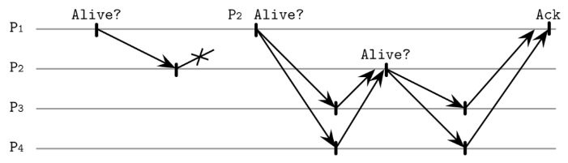
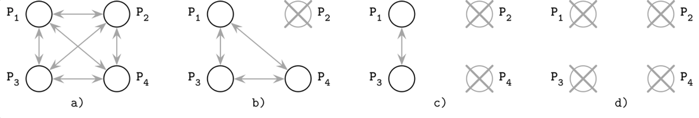

# Chapter 9. Failure Detection 
- failure detector 
  - liveness: 프로세스가 의도한 이벤트를 정상적으로 수행하는지 여부 
  - safety: 프로세스가 의도하지 않은 이벤트를 수행하지 않는지 여부 
  - completeness: 프로세스 실패에 대한 정보가 최종적으로 다른 프로세스에게도 알리는 것 
  - efficiency: 프로세스 실패에 대한 정보를 얼마나 빠르게 알릴 수 있는지 
  - accuracy: 프로세스 실패에 대한 정보가 정확한지
- heartbeats 
  - 대부분의 failure detector에서 사용 
  - `Akka`
    - heartbeat을 사용해 process failure을 감지 
- timeout-free failure detector 
  - heartbeat counter 
    - global view 
  - 각 프로세스는 주변 프로세스의 heartbeat counter을 저장 
  - heartbeat counter을 프로세스 to 프로세스로 전달 
- outsourced heartbeats 

  - heartbeat을 전달하는 프로세스를 위임 
  - 안전성 향상 
- Phi-Accural failure detector 
  - 프로세스의 상태를 up or down의 이분법적으로 나누지 않음 
  - 프로세스의 상태를 연속적인 값으로 표현: `phi`
    - `Phi` = suspicion level 
  - `Akka`
    - `Akka`에서는 `Phi`를 `threshold`로 표현 
    - `threshold`를 초과하면 프로세스를 `down`으로 간주
    - https://doc.akka.io/docs/akka/current/typed/failure-detector.html
- Gossip and Failure Detection 
  - `gossip`
    - 이웃 프로세스의 상태 정보를 수집하고 전파하는 방법 
    - 주변 프로세스로부터 heartbeat counter 정보를 받으면 local heartbeat counter 정보와 병합해서 다른 프로세스로 전달 
- FUSE(Failure Notification Service)

  - 프로세스를 group으로 묶음 
  - Group에 속한 하나의 프로세스가 죽으면 더 이상 ping message에 응답하지 않음 
  - single process failure -> group failure 
  - https://www.microsoft.com/en-us/research/publication/fuse-lightweight-guaranteed-distributed-failure-notification/ 
